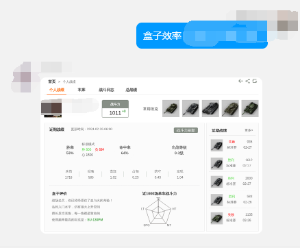
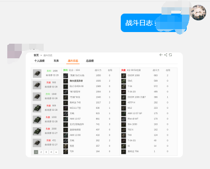
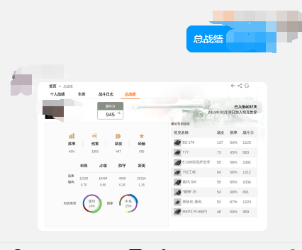

# Wotbox-Onebot

使用onebot协议，基于[Shiro](https://github.com/MisakaTAT/Shiro)开发。


可以从偶游坦克世界盒子查询效率截图并发送。


## 使用

### 本地部署
#### 环境

JDK 17

Chrome

#### 命令

shiro.chrome.path值替换为Chrome安装路径

``` java -jar wotbox-onebot-1.0-SNAPSHOT.jar --shiro.chrome.path=/opt/google/chrome/chrome```

### Docker部署


```
docker run -it -d --name wotbox-onebot -p 5555:5555 caelumlux/wotbox-onebot:1.0.0
 ```
### 配置

默认端口5555   
在你的onebot client 添加反向代理代理

```ws://ip:5555/ws/wotbox```

#### go-cqhttp:

```yaml
# 连接服务列表
servers:
  # 反向WS设置
  - ws-reverse:
      # 反向WS Universal 地址
      # 注意 设置了此项地址后下面两项将会被忽略
      universal: ws://127.0.0.1:5555/ws/wotbox
      # 反向WS API 地址
      api: ws://your_websocket_api.server
      # 反向WS Event 地址
      event: ws://your_websocket_event.server
      # 重连间隔 单位毫秒
      reconnect-interval: 3000
      middlewares:
        <<: *default # 引用默认中间

```
#### Lagrange.Core
```yaml
    {
      "Type": "ReverseWebSocket",
      "Host": "ws://127.0.0.1",
      "Port": 5555,
      "Suffix": "/ws/wotbox",
      "ReconnectInterval": 5000,
      "HeartBeatInterval": 5000,
      "AccessToken": ""
    }

```

### 指令

指令+玩家名 如 ：
```盒子效率 玩家XXX```

#### 盒子效率



#### 战斗日志

#### 总战绩

盒子的车库没做，嫌弃车子显示排序。

